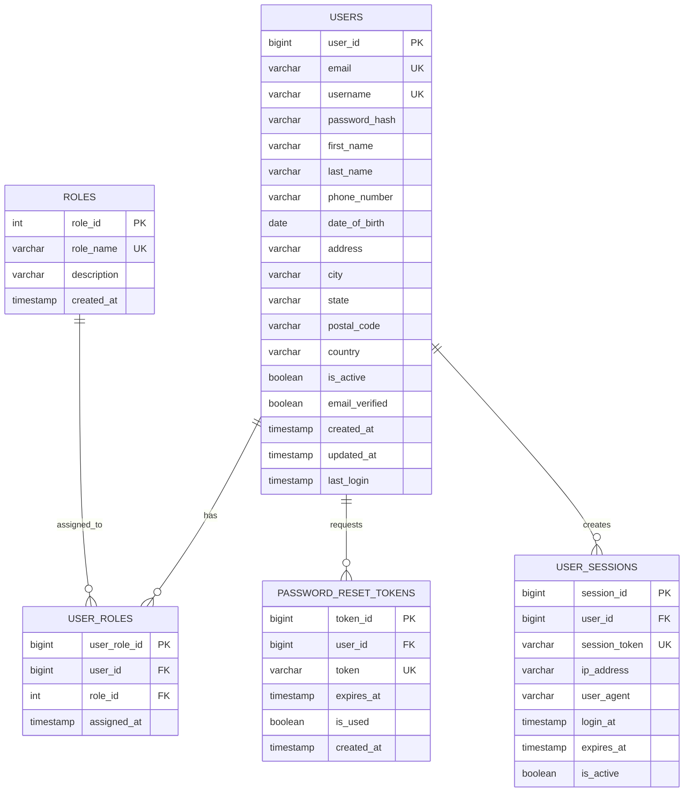
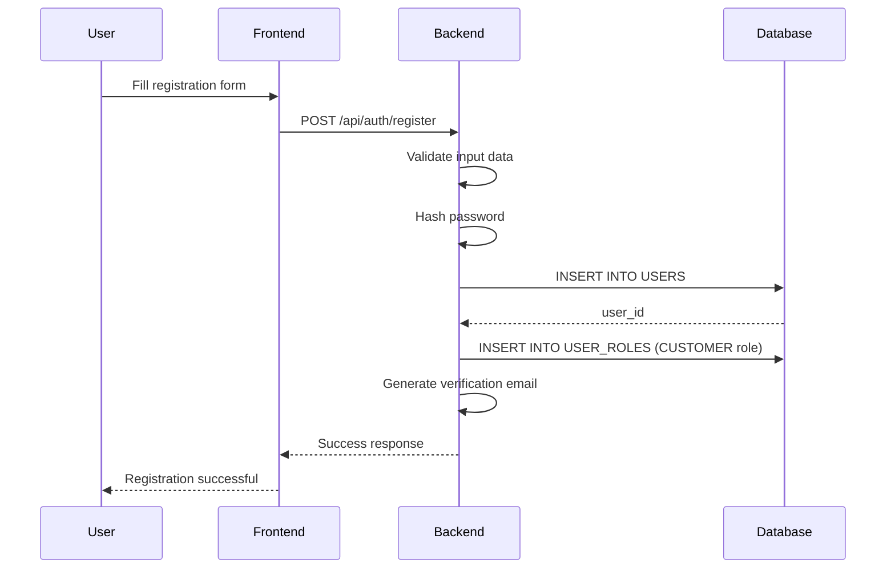
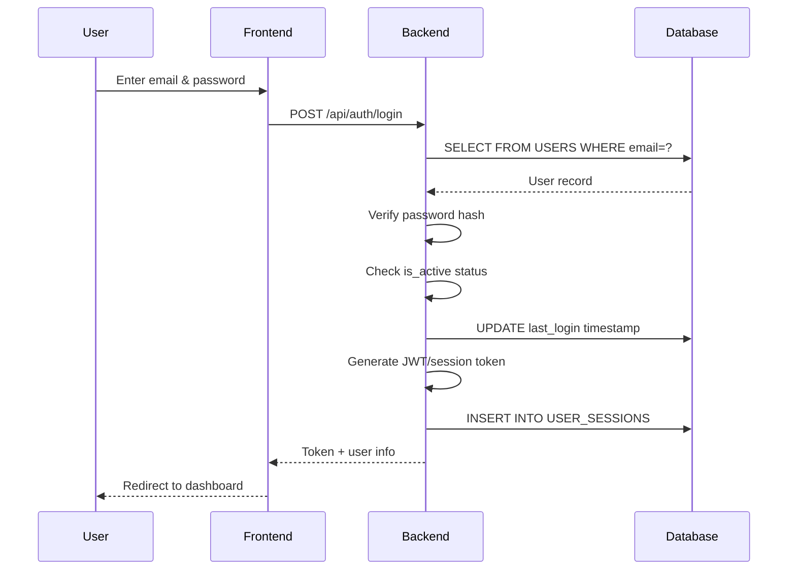
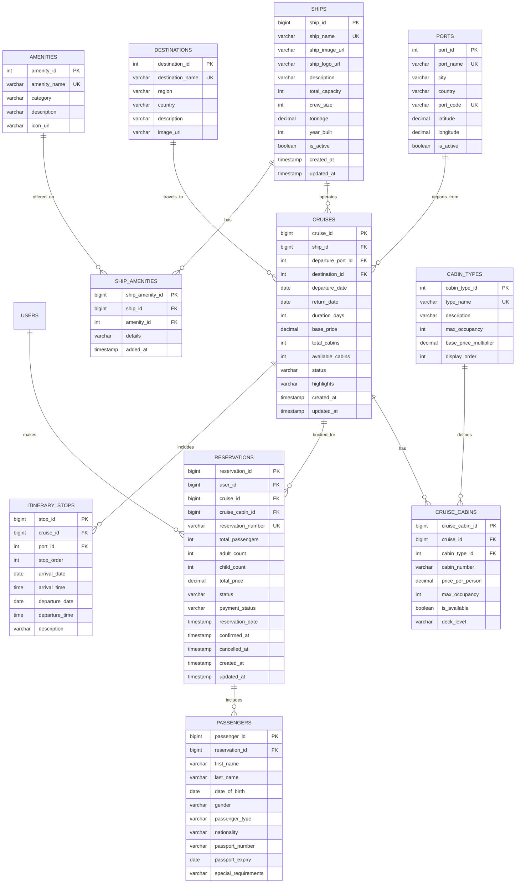
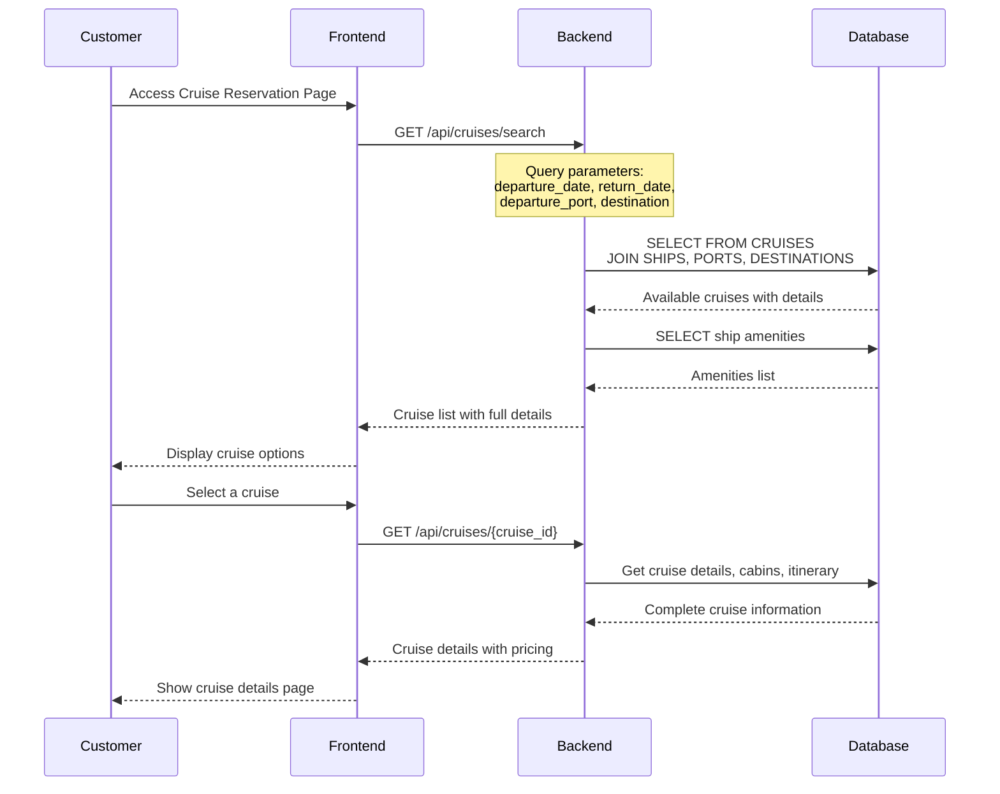
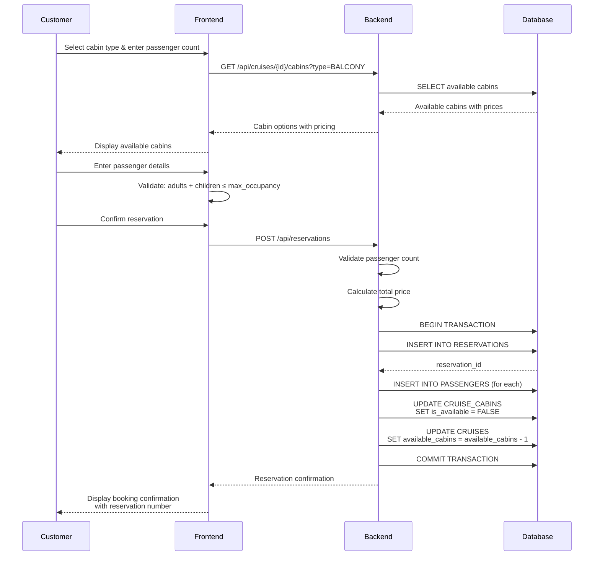

# Database Diagram - Online Cruise Booking System

## Table of Contents
1. [User Authentication & Registration Module](#user-authentication--registration-module)
2. [Cruise Reservation Module](#cruise-reservation-module)

---

## User Authentication & Registration Module

### Entity Relationship Diagram



---

## Table Definitions

### 1. USERS Table
**Purpose:** Stores user account information for both sign-in and registration

| Column Name      | Data Type      | Constraints                    | Description                          |
|------------------|----------------|--------------------------------|--------------------------------------|
| user_id          | BIGINT         | PRIMARY KEY, AUTO_INCREMENT    | Unique identifier for each user      |
| email            | VARCHAR(255)   | UNIQUE, NOT NULL               | User's email address (used for login)|
| username         | VARCHAR(50)    | UNIQUE, NOT NULL               | Unique username (optional login)     |
| password_hash    | VARCHAR(255)   | NOT NULL                       | Bcrypt/Argon2 hashed password        |
| first_name       | VARCHAR(100)   | NOT NULL                       | User's first name                    |
| last_name        | VARCHAR(100)   | NOT NULL                       | User's last name                     |
| phone_number     | VARCHAR(20)    | NULL                           | Contact phone number                 |
| date_of_birth    | DATE           | NULL                           | User's date of birth                 |
| address          | VARCHAR(255)   | NULL                           | Street address                       |
| city             | VARCHAR(100)   | NULL                           | City                                 |
| state            | VARCHAR(100)   | NULL                           | State/Province                       |
| postal_code      | VARCHAR(20)    | NULL                           | Postal/ZIP code                      |
| country          | VARCHAR(100)   | NULL                           | Country                              |
| is_active        | BOOLEAN        | DEFAULT TRUE                   | Account active status                |
| email_verified   | BOOLEAN        | DEFAULT FALSE                  | Email verification status            |
| created_at       | TIMESTAMP      | DEFAULT CURRENT_TIMESTAMP      | Account creation timestamp           |
| updated_at       | TIMESTAMP      | ON UPDATE CURRENT_TIMESTAMP    | Last update timestamp                |
| last_login       | TIMESTAMP      | NULL                           | Last successful login                |

**Indexes:**
- PRIMARY KEY: `user_id`
- UNIQUE INDEX: `email`
- UNIQUE INDEX: `username`
- INDEX: `email_verified`, `is_active`

---

### 2. ROLES Table
**Purpose:** Defines user roles (Customer, Admin, Staff, etc.)

| Column Name | Data Type    | Constraints                 | Description                    |
|-------------|--------------|----------------------------|--------------------------------|
| role_id     | INT          | PRIMARY KEY, AUTO_INCREMENT| Unique role identifier         |
| role_name   | VARCHAR(50)  | UNIQUE, NOT NULL           | Role name (CUSTOMER, ADMIN)    |
| description | VARCHAR(255) | NULL                       | Role description               |
| created_at  | TIMESTAMP    | DEFAULT CURRENT_TIMESTAMP  | Role creation timestamp        |

**Default Roles:**
- `CUSTOMER` - Regular cruise booking customers
- `ADMIN` - System administrators
- `STAFF` - Cruise company staff
- `MANAGER` - Cruise managers

**Indexes:**
- PRIMARY KEY: `role_id`
- UNIQUE INDEX: `role_name`

---

### 3. USER_ROLES Table
**Purpose:** Many-to-many relationship between users and roles

| Column Name   | Data Type | Constraints                       | Description                      |
|---------------|-----------|-----------------------------------|----------------------------------|
| user_role_id  | BIGINT    | PRIMARY KEY, AUTO_INCREMENT       | Unique identifier                |
| user_id       | BIGINT    | FOREIGN KEY (USERS.user_id)       | Reference to user                |
| role_id       | INT       | FOREIGN KEY (ROLES.role_id)       | Reference to role                |
| assigned_at   | TIMESTAMP | DEFAULT CURRENT_TIMESTAMP         | Role assignment timestamp        |

**Indexes:**
- PRIMARY KEY: `user_role_id`
- UNIQUE INDEX: `user_id`, `role_id` (composite)
- FOREIGN KEY: `user_id` REFERENCES `USERS(user_id)` ON DELETE CASCADE
- FOREIGN KEY: `role_id` REFERENCES `ROLES(role_id)` ON DELETE CASCADE

---

### 4. PASSWORD_RESET_TOKENS Table
**Purpose:** Manages password reset requests

| Column Name | Data Type    | Constraints                          | Description                        |
|-------------|--------------|--------------------------------------|------------------------------------|
| token_id    | BIGINT       | PRIMARY KEY, AUTO_INCREMENT          | Unique token identifier            |
| user_id     | BIGINT       | FOREIGN KEY (USERS.user_id)          | User requesting reset              |
| token       | VARCHAR(255) | UNIQUE, NOT NULL                     | Reset token (UUID/random string)   |
| expires_at  | TIMESTAMP    | NOT NULL                             | Token expiration time              |
| is_used     | BOOLEAN      | DEFAULT FALSE                        | Whether token has been used        |
| created_at  | TIMESTAMP    | DEFAULT CURRENT_TIMESTAMP            | Token creation timestamp           |

**Indexes:**
- PRIMARY KEY: `token_id`
- UNIQUE INDEX: `token`
- FOREIGN KEY: `user_id` REFERENCES `USERS(user_id)` ON DELETE CASCADE
- INDEX: `expires_at`, `is_used`

---

### 5. USER_SESSIONS Table
**Purpose:** Tracks user login sessions for security

| Column Name    | Data Type    | Constraints                       | Description                        |
|----------------|--------------|-----------------------------------|------------------------------------|
| session_id     | BIGINT       | PRIMARY KEY, AUTO_INCREMENT       | Unique session identifier          |
| user_id        | BIGINT       | FOREIGN KEY (USERS.user_id)       | User who created session           |
| session_token  | VARCHAR(255) | UNIQUE, NOT NULL                  | JWT or session token               |
| ip_address     | VARCHAR(45)  | NULL                              | User's IP address (IPv6 compatible)|
| user_agent     | VARCHAR(255) | NULL                              | Browser/device information         |
| login_at       | TIMESTAMP    | DEFAULT CURRENT_TIMESTAMP         | Login timestamp                    |
| expires_at     | TIMESTAMP    | NOT NULL                          | Session expiration time            |
| is_active      | BOOLEAN      | DEFAULT TRUE                      | Session active status              |

**Indexes:**
- PRIMARY KEY: `session_id`
- UNIQUE INDEX: `session_token`
- FOREIGN KEY: `user_id` REFERENCES `USERS(user_id)` ON DELETE CASCADE
- INDEX: `user_id`, `is_active`

---

## User Authentication Workflows

### 1. User Registration Flow



**Steps:**
1. User provides: email, username, password, first_name, last_name, etc.
2. Backend validates:
   - Email format and uniqueness
   - Username availability
   - Password strength (min 8 chars, complexity rules)
3. Password is hashed using bcrypt/Argon2
4. User record created with `is_active=true`, `email_verified=false`
5. Default role `CUSTOMER` assigned in USER_ROLES
6. Verification email sent (optional)
7. Success response returned

---

### 2. User Sign-In Flow



**Steps:**
1. User provides: email/username and password
2. Backend queries USERS table by email/username
3. Verify password hash matches
4. Check `is_active=true` and optionally `email_verified=true`
5. Update `last_login` timestamp
6. Generate JWT token or session token
7. Create session record in USER_SESSIONS
8. Return token and user profile to frontend

---

## SQL Schema Creation Scripts

### Create USERS Table
```sql
CREATE TABLE users (
    user_id BIGINT AUTO_INCREMENT PRIMARY KEY,
    email VARCHAR(255) NOT NULL UNIQUE,
    username VARCHAR(50) NOT NULL UNIQUE,
    password_hash VARCHAR(255) NOT NULL,
    first_name VARCHAR(100) NOT NULL,
    last_name VARCHAR(100) NOT NULL,
    phone_number VARCHAR(20),
    date_of_birth DATE,
    address VARCHAR(255),
    city VARCHAR(100),
    state VARCHAR(100),
    postal_code VARCHAR(20),
    country VARCHAR(100),
    is_active BOOLEAN DEFAULT TRUE,
    email_verified BOOLEAN DEFAULT FALSE,
    created_at TIMESTAMP DEFAULT CURRENT_TIMESTAMP,
    updated_at TIMESTAMP DEFAULT CURRENT_TIMESTAMP ON UPDATE CURRENT_TIMESTAMP,
    last_login TIMESTAMP NULL,
    INDEX idx_email (email),
    INDEX idx_username (username),
    INDEX idx_active_verified (is_active, email_verified)
);
```

### Create ROLES Table
```sql
CREATE TABLE roles (
    role_id INT AUTO_INCREMENT PRIMARY KEY,
    role_name VARCHAR(50) NOT NULL UNIQUE,
    description VARCHAR(255),
    created_at TIMESTAMP DEFAULT CURRENT_TIMESTAMP,
    INDEX idx_role_name (role_name)
);

-- Insert default roles
INSERT INTO roles (role_name, description) VALUES
('CUSTOMER', 'Regular cruise booking customer'),
('ADMIN', 'System administrator'),
('STAFF', 'Cruise company staff member'),
('MANAGER', 'Cruise operation manager');
```

### Create USER_ROLES Table
```sql
CREATE TABLE user_roles (
    user_role_id BIGINT AUTO_INCREMENT PRIMARY KEY,
    user_id BIGINT NOT NULL,
    role_id INT NOT NULL,
    assigned_at TIMESTAMP DEFAULT CURRENT_TIMESTAMP,
    UNIQUE KEY unique_user_role (user_id, role_id),
    FOREIGN KEY (user_id) REFERENCES users(user_id) ON DELETE CASCADE,
    FOREIGN KEY (role_id) REFERENCES roles(role_id) ON DELETE CASCADE,
    INDEX idx_user_id (user_id),
    INDEX idx_role_id (role_id)
);
```

### Create PASSWORD_RESET_TOKENS Table
```sql
CREATE TABLE password_reset_tokens (
    token_id BIGINT AUTO_INCREMENT PRIMARY KEY,
    user_id BIGINT NOT NULL,
    token VARCHAR(255) NOT NULL UNIQUE,
    expires_at TIMESTAMP NOT NULL,
    is_used BOOLEAN DEFAULT FALSE,
    created_at TIMESTAMP DEFAULT CURRENT_TIMESTAMP,
    FOREIGN KEY (user_id) REFERENCES users(user_id) ON DELETE CASCADE,
    INDEX idx_token (token),
    INDEX idx_expires (expires_at, is_used)
);
```

### Create USER_SESSIONS Table
```sql
CREATE TABLE user_sessions (
    session_id BIGINT AUTO_INCREMENT PRIMARY KEY,
    user_id BIGINT NOT NULL,
    session_token VARCHAR(255) NOT NULL UNIQUE,
    ip_address VARCHAR(45),
    user_agent VARCHAR(255),
    login_at TIMESTAMP DEFAULT CURRENT_TIMESTAMP,
    expires_at TIMESTAMP NOT NULL,
    is_active BOOLEAN DEFAULT TRUE,
    FOREIGN KEY (user_id) REFERENCES users(user_id) ON DELETE CASCADE,
    INDEX idx_session_token (session_token),
    INDEX idx_user_active (user_id, is_active)
);
```

---

## Security Considerations

1. **Password Storage:**
   - Never store plain-text passwords
   - Use bcrypt, Argon2, or PBKDF2 for hashing
   - Set minimum password complexity requirements

2. **Session Management:**
   - Use secure, random session tokens (JWT or UUID)
   - Set appropriate expiration times
   - Implement token refresh mechanism
   - Store tokens securely (httpOnly cookies)

3. **Email Verification:**
   - Send verification link after registration
   - Set `email_verified=false` initially
   - Require verification before certain actions

4. **Account Security:**
   - Implement rate limiting for login attempts
   - Lock accounts after multiple failed attempts
   - Log all authentication events
   - Use HTTPS for all authentication endpoints

5. **Data Protection:**
   - Encrypt sensitive data at rest
   - Use parameterized queries to prevent SQL injection
   - Implement proper authorization checks
   - Regular security audits

---

## Sample Queries

### Register New User
```sql
-- 1. Insert user
INSERT INTO users (email, username, password_hash, first_name, last_name, is_active, email_verified)
VALUES ('user@example.com', 'johndoe', '$2a$10$...', 'John', 'Doe', TRUE, FALSE);

-- 2. Assign default CUSTOMER role
INSERT INTO user_roles (user_id, role_id)
VALUES (LAST_INSERT_ID(), (SELECT role_id FROM roles WHERE role_name = 'CUSTOMER'));
```

### Authenticate User (Sign-In)
```sql
-- 1. Get user by email
SELECT u.user_id, u.email, u.username, u.password_hash, u.first_name, u.last_name, 
       u.is_active, u.email_verified, r.role_name
FROM users u
LEFT JOIN user_roles ur ON u.user_id = ur.user_id
LEFT JOIN roles r ON ur.role_id = r.role_id
WHERE u.email = 'user@example.com'
AND u.is_active = TRUE;

-- 2. If password verified, update last login
UPDATE users SET last_login = CURRENT_TIMESTAMP WHERE user_id = ?;

-- 3. Create session
INSERT INTO user_sessions (user_id, session_token, ip_address, user_agent, expires_at)
VALUES (?, 'jwt-token-here', '192.168.1.1', 'Mozilla/5.0...', DATE_ADD(NOW(), INTERVAL 24 HOUR));
```

### Get User Profile
```sql
SELECT u.user_id, u.email, u.username, u.first_name, u.last_name, 
       u.phone_number, u.address, u.city, u.state, u.country,
       GROUP_CONCAT(r.role_name) as roles
FROM users u
LEFT JOIN user_roles ur ON u.user_id = ur.user_id
LEFT JOIN roles r ON ur.role_id = r.role_id
WHERE u.user_id = ?
GROUP BY u.user_id;
```

---

## Additional Features to Consider

1. **Email Verification System**
   - Add `email_verification_tokens` table
   - Implement verification workflow

2. **Two-Factor Authentication (2FA)**
   - Add `user_2fa_settings` table
   - Store TOTP secrets, backup codes

3. **Social Login Integration**
   - Add `user_social_accounts` table
   - Support Google, Facebook OAuth

4. **Login History/Audit Trail**
   - Add `login_attempts` table
   - Track successful and failed attempts

5. **Account Preferences**
   - Add `user_preferences` table
   - Store notification settings, language, etc.

---

---

# Cruise Reservation Module

## Entity Relationship Diagram



---

## Table Definitions

### 1. SHIPS Table
**Purpose:** Stores cruise ship information

| Column Name      | Data Type      | Constraints                    | Description                          |
|------------------|----------------|--------------------------------|--------------------------------------|
| ship_id          | BIGINT         | PRIMARY KEY, AUTO_INCREMENT    | Unique ship identifier               |
| ship_name        | VARCHAR(100)   | UNIQUE, NOT NULL               | Name of the ship                     |
| ship_image_url   | VARCHAR(500)   | NULL                           | URL to ship image                    |
| ship_logo_url    | VARCHAR(500)   | NULL                           | URL to ship logo                     |
| description      | TEXT           | NULL                           | Ship description and features        |
| total_capacity   | INT            | NOT NULL                       | Maximum passenger capacity           |
| crew_size        | INT            | NULL                           | Number of crew members               |
| tonnage          | DECIMAL(10,2)  | NULL                           | Ship tonnage                         |
| year_built       | INT            | NULL                           | Year the ship was built              |
| is_active        | BOOLEAN        | DEFAULT TRUE                   | Ship active status                   |
| created_at       | TIMESTAMP      | DEFAULT CURRENT_TIMESTAMP      | Record creation timestamp            |
| updated_at       | TIMESTAMP      | ON UPDATE CURRENT_TIMESTAMP    | Last update timestamp                |

**Indexes:**
- PRIMARY KEY: `ship_id`
- UNIQUE INDEX: `ship_name`
- INDEX: `is_active`

---

### 2. AMENITIES Table
**Purpose:** Master list of onboard amenities

| Column Name   | Data Type    | Constraints                 | Description                    |
|---------------|--------------|----------------------------|--------------------------------|
| amenity_id    | INT          | PRIMARY KEY, AUTO_INCREMENT| Unique amenity identifier      |
| amenity_name  | VARCHAR(100) | UNIQUE, NOT NULL           | Amenity name                   |
| category      | VARCHAR(50)  | NULL                       | Category (Dining, Entertainment, etc.) |
| description   | VARCHAR(255) | NULL                       | Amenity description            |
| icon_url      | VARCHAR(500) | NULL                       | Icon/image URL                 |

**Common Amenities:**
- Swimming Pool, Spa, Fitness Center, Casino, Theater, Restaurants, Kids Club, etc.

**Indexes:**
- PRIMARY KEY: `amenity_id`
- UNIQUE INDEX: `amenity_name`
- INDEX: `category`

---

### 3. SHIP_AMENITIES Table
**Purpose:** Links ships with their amenities

| Column Name      | Data Type    | Constraints                       | Description                      |
|------------------|--------------|-----------------------------------|----------------------------------|
| ship_amenity_id  | BIGINT       | PRIMARY KEY, AUTO_INCREMENT       | Unique identifier                |
| ship_id          | BIGINT       | FOREIGN KEY (SHIPS.ship_id)       | Reference to ship                |
| amenity_id       | INT          | FOREIGN KEY (AMENITIES.amenity_id)| Reference to amenity             |
| details          | VARCHAR(255) | NULL                              | Specific details for this ship   |
| added_at         | TIMESTAMP    | DEFAULT CURRENT_TIMESTAMP         | When amenity was added           |

**Indexes:**
- PRIMARY KEY: `ship_amenity_id`
- UNIQUE INDEX: `ship_id`, `amenity_id` (composite)
- FOREIGN KEY: `ship_id` REFERENCES `SHIPS(ship_id)` ON DELETE CASCADE
- FOREIGN KEY: `amenity_id` REFERENCES `AMENITIES(amenity_id)` ON DELETE CASCADE

---

### 4. PORTS Table
**Purpose:** Stores departure port information

| Column Name | Data Type     | Constraints                 | Description                    |
|-------------|---------------|----------------------------|--------------------------------|
| port_id     | INT           | PRIMARY KEY, AUTO_INCREMENT| Unique port identifier         |
| port_name   | VARCHAR(100)  | UNIQUE, NOT NULL           | Port name                      |
| city        | VARCHAR(100)  | NOT NULL                   | City name                      |
| country     | VARCHAR(100)  | NOT NULL                   | Country name                   |
| port_code   | VARCHAR(10)   | UNIQUE, NOT NULL           | Port code (e.g., MIA, NYC)     |
| latitude    | DECIMAL(10,8) | NULL                       | Geographic latitude            |
| longitude   | DECIMAL(11,8) | NULL                       | Geographic longitude           |
| is_active   | BOOLEAN       | DEFAULT TRUE               | Port active status             |

**Indexes:**
- PRIMARY KEY: `port_id`
- UNIQUE INDEX: `port_name`
- UNIQUE INDEX: `port_code`
- INDEX: `country`, `is_active`

---

### 5. DESTINATIONS Table
**Purpose:** Stores cruise destinations

| Column Name        | Data Type    | Constraints                 | Description                    |
|--------------------|--------------|----------------------------|--------------------------------|
| destination_id     | INT          | PRIMARY KEY, AUTO_INCREMENT| Unique destination identifier  |
| destination_name   | VARCHAR(100) | UNIQUE, NOT NULL           | Destination name               |
| region             | VARCHAR(100) | NULL                       | Region (Caribbean, Mediterranean, etc.) |
| country            | VARCHAR(100) | NULL                       | Country                        |
| description        | TEXT         | NULL                       | Destination description        |
| image_url          | VARCHAR(500) | NULL                       | Destination image URL          |

**Indexes:**
- PRIMARY KEY: `destination_id`
- UNIQUE INDEX: `destination_name`
- INDEX: `region`

---

### 6. CABIN_TYPES Table
**Purpose:** Defines different cabin types and their characteristics

| Column Name           | Data Type     | Constraints                 | Description                    |
|-----------------------|---------------|----------------------------|--------------------------------|
| cabin_type_id         | INT           | PRIMARY KEY, AUTO_INCREMENT| Unique cabin type identifier   |
| type_name             | VARCHAR(50)   | UNIQUE, NOT NULL           | Cabin type name                |
| description           | TEXT          | NULL                       | Cabin type description         |
| max_occupancy         | INT           | NOT NULL                   | Maximum number of guests       |
| base_price_multiplier | DECIMAL(5,2)  | DEFAULT 1.00               | Price multiplier vs base       |
| display_order         | INT           | DEFAULT 0                  | Display order in UI            |

**Default Cabin Types:**
- `Interior` - Inside cabins without windows
- `Ocean View` - Cabins with windows or portholes
- `Balcony` - Cabins with private balconies
- `Suite` - Luxury suites with enhanced amenities

**Indexes:**
- PRIMARY KEY: `cabin_type_id`
- UNIQUE INDEX: `type_name`
- INDEX: `display_order`

---

### 7. CRUISES Table
**Purpose:** Stores cruise itineraries and schedules

| Column Name        | Data Type     | Constraints                       | Description                      |
|--------------------|---------------|-----------------------------------|----------------------------------|
| cruise_id          | BIGINT        | PRIMARY KEY, AUTO_INCREMENT       | Unique cruise identifier         |
| ship_id            | BIGINT        | FOREIGN KEY (SHIPS.ship_id)       | Ship operating this cruise       |
| departure_port_id  | INT           | FOREIGN KEY (PORTS.port_id)       | Departure port                   |
| destination_id     | INT           | FOREIGN KEY (DESTINATIONS.dest.id)| Primary destination              |
| departure_date     | DATE          | NOT NULL                          | Cruise departure date            |
| return_date        | DATE          | NOT NULL                          | Cruise return date               |
| duration_days      | INT           | NOT NULL                          | Cruise duration in days          |
| base_price         | DECIMAL(10,2) | NOT NULL                          | Base price per person            |
| total_cabins       | INT           | NOT NULL                          | Total cabins available           |
| available_cabins   | INT           | NOT NULL                          | Currently available cabins       |
| status             | VARCHAR(20)   | DEFAULT 'SCHEDULED'               | SCHEDULED, BOARDING, SAILING, COMPLETED, CANCELLED |
| highlights         | TEXT          | NULL                              | Itinerary highlights             |
| created_at         | TIMESTAMP     | DEFAULT CURRENT_TIMESTAMP         | Record creation timestamp        |
| updated_at         | TIMESTAMP     | ON UPDATE CURRENT_TIMESTAMP       | Last update timestamp            |

**Indexes:**
- PRIMARY KEY: `cruise_id`
- FOREIGN KEY: `ship_id` REFERENCES `SHIPS(ship_id)`
- FOREIGN KEY: `departure_port_id` REFERENCES `PORTS(port_id)`
- FOREIGN KEY: `destination_id` REFERENCES `DESTINATIONS(destination_id)`
- INDEX: `departure_date`, `return_date`
- INDEX: `status`, `available_cabins`

---

### 8. CRUISE_CABINS Table
**Purpose:** Stores specific cabin information for each cruise

| Column Name      | Data Type     | Constraints                         | Description                      |
|------------------|---------------|-------------------------------------|----------------------------------|
| cruise_cabin_id  | BIGINT        | PRIMARY KEY, AUTO_INCREMENT         | Unique cabin identifier          |
| cruise_id        | BIGINT        | FOREIGN KEY (CRUISES.cruise_id)     | Reference to cruise              |
| cabin_type_id    | INT           | FOREIGN KEY (CABIN_TYPES.c_type_id) | Cabin type                       |
| cabin_number     | VARCHAR(20)   | NOT NULL                            | Cabin number (e.g., A101)        |
| price_per_person | DECIMAL(10,2) | NOT NULL                            | Price per person for this cabin  |
| max_occupancy    | INT           | NOT NULL                            | Maximum guests for this cabin    |
| is_available     | BOOLEAN       | DEFAULT TRUE                        | Availability status              |
| deck_level       | VARCHAR(20)   | NULL                                | Deck level (e.g., Deck 7)        |

**Indexes:**
- PRIMARY KEY: `cruise_cabin_id`
- UNIQUE INDEX: `cruise_id`, `cabin_number` (composite)
- FOREIGN KEY: `cruise_id` REFERENCES `CRUISES(cruise_id)` ON DELETE CASCADE
- FOREIGN KEY: `cabin_type_id` REFERENCES `CABIN_TYPES(cabin_type_id)`
- INDEX: `is_available`, `cabin_type_id`

---

### 9. ITINERARY_STOPS Table
**Purpose:** Stores port stops during the cruise

| Column Name    | Data Type    | Constraints                     | Description                      |
|----------------|--------------|--------------------------------|----------------------------------|
| stop_id        | BIGINT       | PRIMARY KEY, AUTO_INCREMENT     | Unique stop identifier           |
| cruise_id      | BIGINT       | FOREIGN KEY (CRUISES.cruise_id) | Reference to cruise              |
| port_id        | INT          | FOREIGN KEY (PORTS.port_id)     | Port of call                     |
| stop_order     | INT          | NOT NULL                        | Order in itinerary (1, 2, 3...)  |
| arrival_date   | DATE         | NOT NULL                        | Arrival date                     |
| arrival_time   | TIME         | NULL                            | Arrival time                     |
| departure_date | DATE         | NOT NULL                        | Departure date                   |
| departure_time | TIME         | NULL                            | Departure time                   |
| description    | TEXT         | NULL                            | Stop description/activities      |

**Indexes:**
- PRIMARY KEY: `stop_id`
- FOREIGN KEY: `cruise_id` REFERENCES `CRUISES(cruise_id)` ON DELETE CASCADE
- FOREIGN KEY: `port_id` REFERENCES `PORTS(port_id)`
- INDEX: `cruise_id`, `stop_order` (composite)

---

### 10. RESERVATIONS Table
**Purpose:** Stores customer cruise reservations/bookings

| Column Name        | Data Type     | Constraints                         | Description                      |
|--------------------|---------------|-------------------------------------|----------------------------------|
| reservation_id     | BIGINT        | PRIMARY KEY, AUTO_INCREMENT         | Unique reservation identifier    |
| user_id            | BIGINT        | FOREIGN KEY (USERS.user_id)         | Customer who made reservation    |
| cruise_id          | BIGINT        | FOREIGN KEY (CRUISES.cruise_id)     | Booked cruise                    |
| cruise_cabin_id    | BIGINT        | FOREIGN KEY (CRUISE_CABINS.cc_id)   | Assigned cabin                   |
| reservation_number | VARCHAR(20)   | UNIQUE, NOT NULL                    | Unique booking reference number  |
| total_passengers   | INT           | NOT NULL                            | Total number of passengers       |
| adult_count        | INT           | NOT NULL                            | Number of adults                 |
| child_count        | INT           | DEFAULT 0                           | Number of children               |
| total_price        | DECIMAL(10,2) | NOT NULL                            | Total booking price              |
| status             | VARCHAR(20)   | DEFAULT 'PENDING'                   | PENDING, CONFIRMED, CANCELLED, COMPLETED |
| payment_status     | VARCHAR(20)   | DEFAULT 'UNPAID'                    | UNPAID, PARTIAL, PAID, REFUNDED  |
| reservation_date   | TIMESTAMP     | DEFAULT CURRENT_TIMESTAMP           | When reservation was made        |
| confirmed_at       | TIMESTAMP     | NULL                                | Confirmation timestamp           |
| cancelled_at       | TIMESTAMP     | NULL                                | Cancellation timestamp           |
| created_at         | TIMESTAMP     | DEFAULT CURRENT_TIMESTAMP           | Record creation timestamp        |
| updated_at         | TIMESTAMP     | ON UPDATE CURRENT_TIMESTAMP         | Last update timestamp            |

**Indexes:**
- PRIMARY KEY: `reservation_id`
- UNIQUE INDEX: `reservation_number`
- FOREIGN KEY: `user_id` REFERENCES `USERS(user_id)`
- FOREIGN KEY: `cruise_id` REFERENCES `CRUISES(cruise_id)`
- FOREIGN KEY: `cruise_cabin_id` REFERENCES `CRUISE_CABINS(cruise_cabin_id)`
- INDEX: `user_id`, `status`
- INDEX: `reservation_date`

---

### 11. PASSENGERS Table
**Purpose:** Stores individual passenger information for each reservation

| Column Name         | Data Type    | Constraints                           | Description                      |
|---------------------|--------------|---------------------------------------|----------------------------------|
| passenger_id        | BIGINT       | PRIMARY KEY, AUTO_INCREMENT           | Unique passenger identifier      |
| reservation_id      | BIGINT       | FOREIGN KEY (RESERVATIONS.res_id)     | Reference to reservation         |
| first_name          | VARCHAR(100) | NOT NULL                              | Passenger first name             |
| last_name           | VARCHAR(100) | NOT NULL                              | Passenger last name              |
| date_of_birth       | DATE         | NOT NULL                              | Passenger date of birth          |
| gender              | VARCHAR(10)  | NULL                                  | Gender                           |
| passenger_type      | VARCHAR(20)  | NOT NULL                              | ADULT or CHILD                   |
| nationality         | VARCHAR(100) | NULL                                  | Passenger nationality            |
| passport_number     | VARCHAR(50)  | NULL                                  | Passport number                  |
| passport_expiry     | DATE         | NULL                                  | Passport expiry date             |
| special_requirements| TEXT         | NULL                                  | Dietary/accessibility needs      |

**Indexes:**
- PRIMARY KEY: `passenger_id`
- FOREIGN KEY: `reservation_id` REFERENCES `RESERVATIONS(reservation_id)` ON DELETE CASCADE
- INDEX: `reservation_id`

---

## Cruise Reservation Workflow

### Cruise Search & Selection Flow



### Cabin Selection & Booking Flow



---

## SQL Schema Creation Scripts

### Create SHIPS Table
```sql
CREATE TABLE ships (
    ship_id BIGINT AUTO_INCREMENT PRIMARY KEY,
    ship_name VARCHAR(100) NOT NULL UNIQUE,
    ship_image_url VARCHAR(500),
    ship_logo_url VARCHAR(500),
    description TEXT,
    total_capacity INT NOT NULL,
    crew_size INT,
    tonnage DECIMAL(10,2),
    year_built INT,
    is_active BOOLEAN DEFAULT TRUE,
    created_at TIMESTAMP DEFAULT CURRENT_TIMESTAMP,
    updated_at TIMESTAMP DEFAULT CURRENT_TIMESTAMP ON UPDATE CURRENT_TIMESTAMP,
    INDEX idx_ship_name (ship_name),
    INDEX idx_active (is_active)
);
```

### Create AMENITIES Table
```sql
CREATE TABLE amenities (
    amenity_id INT AUTO_INCREMENT PRIMARY KEY,
    amenity_name VARCHAR(100) NOT NULL UNIQUE,
    category VARCHAR(50),
    description VARCHAR(255),
    icon_url VARCHAR(500),
    INDEX idx_amenity_name (amenity_name),
    INDEX idx_category (category)
);

-- Insert common amenities
INSERT INTO amenities (amenity_name, category, description) VALUES
('Swimming Pool', 'Recreation', 'Main swimming pool'),
('Spa & Wellness Center', 'Wellness', 'Full-service spa'),
('Fitness Center', 'Wellness', '24-hour fitness facility'),
('Casino', 'Entertainment', 'Full-service casino'),
('Theater', 'Entertainment', 'Live entertainment venue'),
('Main Dining Room', 'Dining', 'Formal dining restaurant'),
('Buffet Restaurant', 'Dining', 'Casual buffet dining'),
('Specialty Restaurants', 'Dining', 'Premium dining options'),
('Kids Club', 'Family', 'Supervised children activities'),
('Water Slides', 'Recreation', 'Water park attractions'),
('Rock Climbing Wall', 'Recreation', 'Climbing facility'),
('Mini Golf', 'Recreation', 'Miniature golf course'),
('Library', 'Leisure', 'Reading room and library'),
('Art Gallery', 'Culture', 'Onboard art exhibitions'),
('Shopping', 'Retail', 'Duty-free shops');
```

### Create SHIP_AMENITIES Table
```sql
CREATE TABLE ship_amenities (
    ship_amenity_id BIGINT AUTO_INCREMENT PRIMARY KEY,
    ship_id BIGINT NOT NULL,
    amenity_id INT NOT NULL,
    details VARCHAR(255),
    added_at TIMESTAMP DEFAULT CURRENT_TIMESTAMP,
    UNIQUE KEY unique_ship_amenity (ship_id, amenity_id),
    FOREIGN KEY (ship_id) REFERENCES ships(ship_id) ON DELETE CASCADE,
    FOREIGN KEY (amenity_id) REFERENCES amenities(amenity_id) ON DELETE CASCADE,
    INDEX idx_ship_id (ship_id),
    INDEX idx_amenity_id (amenity_id)
);
```

### Create PORTS Table
```sql
CREATE TABLE ports (
    port_id INT AUTO_INCREMENT PRIMARY KEY,
    port_name VARCHAR(100) NOT NULL UNIQUE,
    city VARCHAR(100) NOT NULL,
    country VARCHAR(100) NOT NULL,
    port_code VARCHAR(10) NOT NULL UNIQUE,
    latitude DECIMAL(10,8),
    longitude DECIMAL(11,8),
    is_active BOOLEAN DEFAULT TRUE,
    INDEX idx_port_name (port_name),
    INDEX idx_port_code (port_code),
    INDEX idx_country_active (country, is_active)
);

-- Insert sample ports
INSERT INTO ports (port_name, city, country, port_code, latitude, longitude) VALUES
('Port of Miami', 'Miami', 'USA', 'MIA', 25.7743, -80.1937),
('Port Canaveral', 'Cape Canaveral', 'USA', 'PCV', 28.4091, -80.6098),
('Port Everglades', 'Fort Lauderdale', 'USA', 'FLL', 26.0922, -80.1166),
('Port of Barcelona', 'Barcelona', 'Spain', 'BCN', 41.3493, 2.1675),
('Port of Southampton', 'Southampton', 'UK', 'SOU', 50.8998, -1.4044),
('Port of Singapore', 'Singapore', 'Singapore', 'SIN', 1.2644, 103.8367);
```

### Create DESTINATIONS Table
```sql
CREATE TABLE destinations (
    destination_id INT AUTO_INCREMENT PRIMARY KEY,
    destination_name VARCHAR(100) NOT NULL UNIQUE,
    region VARCHAR(100),
    country VARCHAR(100),
    description TEXT,
    image_url VARCHAR(500),
    INDEX idx_destination_name (destination_name),
    INDEX idx_region (region)
);

-- Insert sample destinations
INSERT INTO destinations (destination_name, region, country, description) VALUES
('Caribbean Islands', 'Caribbean', 'Multiple', 'Tropical paradise with beautiful beaches'),
('Mediterranean Coast', 'Mediterranean', 'Multiple', 'Historic cities and stunning coastline'),
('Alaska Glaciers', 'Alaska', 'USA', 'Breathtaking glaciers and wildlife'),
('Norwegian Fjords', 'Northern Europe', 'Norway', 'Majestic fjords and scenic beauty'),
('Greek Islands', 'Mediterranean', 'Greece', 'Ancient history and island hopping'),
('Southeast Asia', 'Asia Pacific', 'Multiple', 'Exotic cultures and landscapes');
```

### Create CABIN_TYPES Table
```sql
CREATE TABLE cabin_types (
    cabin_type_id INT AUTO_INCREMENT PRIMARY KEY,
    type_name VARCHAR(50) NOT NULL UNIQUE,
    description TEXT,
    max_occupancy INT NOT NULL,
    base_price_multiplier DECIMAL(5,2) DEFAULT 1.00,
    display_order INT DEFAULT 0,
    INDEX idx_type_name (type_name),
    INDEX idx_display_order (display_order)
);

-- Insert default cabin types
INSERT INTO cabin_types (type_name, description, max_occupancy, base_price_multiplier, display_order) VALUES
('Interior', 'Cozy inside cabin, perfect for budget-conscious travelers', 4, 1.00, 1),
('Ocean View', 'Cabin with window or porthole for natural light and ocean views', 4, 1.25, 2),
('Balcony', 'Private balcony with outdoor seating and ocean views', 4, 1.75, 3),
('Suite', 'Spacious luxury suite with premium amenities and services', 6, 2.50, 4);
```

### Create CRUISES Table
```sql
CREATE TABLE cruises (
    cruise_id BIGINT AUTO_INCREMENT PRIMARY KEY,
    ship_id BIGINT NOT NULL,
    departure_port_id INT NOT NULL,
    destination_id INT NOT NULL,
    departure_date DATE NOT NULL,
    return_date DATE NOT NULL,
    duration_days INT NOT NULL,
    base_price DECIMAL(10,2) NOT NULL,
    total_cabins INT NOT NULL,
    available_cabins INT NOT NULL,
    status VARCHAR(20) DEFAULT 'SCHEDULED',
    highlights TEXT,
    created_at TIMESTAMP DEFAULT CURRENT_TIMESTAMP,
    updated_at TIMESTAMP DEFAULT CURRENT_TIMESTAMP ON UPDATE CURRENT_TIMESTAMP,
    FOREIGN KEY (ship_id) REFERENCES ships(ship_id),
    FOREIGN KEY (departure_port_id) REFERENCES ports(port_id),
    FOREIGN KEY (destination_id) REFERENCES destinations(destination_id),
    INDEX idx_departure_date (departure_date),
    INDEX idx_return_date (return_date),
    INDEX idx_status_availability (status, available_cabins),
    CHECK (return_date > departure_date),
    CHECK (available_cabins <= total_cabins),
    CHECK (status IN ('SCHEDULED', 'BOARDING', 'SAILING', 'COMPLETED', 'CANCELLED'))
);
```

### Create CRUISE_CABINS Table
```sql
CREATE TABLE cruise_cabins (
    cruise_cabin_id BIGINT AUTO_INCREMENT PRIMARY KEY,
    cruise_id BIGINT NOT NULL,
    cabin_type_id INT NOT NULL,
    cabin_number VARCHAR(20) NOT NULL,
    price_per_person DECIMAL(10,2) NOT NULL,
    max_occupancy INT NOT NULL,
    is_available BOOLEAN DEFAULT TRUE,
    deck_level VARCHAR(20),
    UNIQUE KEY unique_cruise_cabin (cruise_id, cabin_number),
    FOREIGN KEY (cruise_id) REFERENCES cruises(cruise_id) ON DELETE CASCADE,
    FOREIGN KEY (cabin_type_id) REFERENCES cabin_types(cabin_type_id),
    INDEX idx_cruise_cabin_type (cruise_id, cabin_type_id),
    INDEX idx_availability (is_available)
);
```

### Create ITINERARY_STOPS Table
```sql
CREATE TABLE itinerary_stops (
    stop_id BIGINT AUTO_INCREMENT PRIMARY KEY,
    cruise_id BIGINT NOT NULL,
    port_id INT NOT NULL,
    stop_order INT NOT NULL,
    arrival_date DATE NOT NULL,
    arrival_time TIME,
    departure_date DATE NOT NULL,
    departure_time TIME,
    description TEXT,
    FOREIGN KEY (cruise_id) REFERENCES cruises(cruise_id) ON DELETE CASCADE,
    FOREIGN KEY (port_id) REFERENCES ports(port_id),
    INDEX idx_cruise_order (cruise_id, stop_order),
    UNIQUE KEY unique_cruise_stop_order (cruise_id, stop_order)
);
```

### Create RESERVATIONS Table
```sql
CREATE TABLE reservations (
    reservation_id BIGINT AUTO_INCREMENT PRIMARY KEY,
    user_id BIGINT NOT NULL,
    cruise_id BIGINT NOT NULL,
    cruise_cabin_id BIGINT NOT NULL,
    reservation_number VARCHAR(20) NOT NULL UNIQUE,
    total_passengers INT NOT NULL,
    adult_count INT NOT NULL,
    child_count INT DEFAULT 0,
    total_price DECIMAL(10,2) NOT NULL,
    status VARCHAR(20) DEFAULT 'PENDING',
    payment_status VARCHAR(20) DEFAULT 'UNPAID',
    reservation_date TIMESTAMP DEFAULT CURRENT_TIMESTAMP,
    confirmed_at TIMESTAMP NULL,
    cancelled_at TIMESTAMP NULL,
    created_at TIMESTAMP DEFAULT CURRENT_TIMESTAMP,
    updated_at TIMESTAMP DEFAULT CURRENT_TIMESTAMP ON UPDATE CURRENT_TIMESTAMP,
    FOREIGN KEY (user_id) REFERENCES users(user_id),
    FOREIGN KEY (cruise_id) REFERENCES cruises(cruise_id),
    FOREIGN KEY (cruise_cabin_id) REFERENCES cruise_cabins(cruise_cabin_id),
    INDEX idx_reservation_number (reservation_number),
    INDEX idx_user_status (user_id, status),
    INDEX idx_reservation_date (reservation_date),
    CHECK (total_passengers = adult_count + child_count),
    CHECK (status IN ('PENDING', 'CONFIRMED', 'CANCELLED', 'COMPLETED')),
    CHECK (payment_status IN ('UNPAID', 'PARTIAL', 'PAID', 'REFUNDED'))
);
```

### Create PASSENGERS Table
```sql
CREATE TABLE passengers (
    passenger_id BIGINT AUTO_INCREMENT PRIMARY KEY,
    reservation_id BIGINT NOT NULL,
    first_name VARCHAR(100) NOT NULL,
    last_name VARCHAR(100) NOT NULL,
    date_of_birth DATE NOT NULL,
    gender VARCHAR(10),
    passenger_type VARCHAR(20) NOT NULL,
    nationality VARCHAR(100),
    passport_number VARCHAR(50),
    passport_expiry DATE,
    special_requirements TEXT,
    FOREIGN KEY (reservation_id) REFERENCES reservations(reservation_id) ON DELETE CASCADE,
    INDEX idx_reservation_id (reservation_id),
    CHECK (passenger_type IN ('ADULT', 'CHILD')),
    CHECK (gender IN ('MALE', 'FEMALE', 'OTHER', NULL))
);
```

---

## Business Logic & Constraints

### Reservation Business Rules

1. **Passenger Count Validation:**
   - Total passengers (adults + children) must not exceed cabin max occupancy
   - At least one adult required per reservation
   - Children count includes passengers under 18 years

2. **Pricing Calculation:**
   ```
   total_price = (cruise.base_price × cabin_type.base_price_multiplier × total_passengers)
   ```

3. **Availability Management:**
   - Cruise cabin `is_available` must be TRUE before booking
   - Update cruise `available_cabins` count after each reservation
   - Prevent double-booking with database transactions

4. **Reservation Number Generation:**
   - Format: `CR-{YEAR}{MONTH}{DAY}-{RANDOM5}` (e.g., CR-20260315-A7B9C)
   - Must be unique across all reservations

5. **Status Transitions:**
   - PENDING → CONFIRMED (after payment)
   - PENDING/CONFIRMED → CANCELLED (customer request)
   - CONFIRMED → COMPLETED (after cruise ends)

---

## Sample Queries

### Search Available Cruises
```sql
SELECT 
    c.cruise_id,
    c.departure_date,
    c.return_date,
    c.duration_days,
    c.base_price,
    c.available_cabins,
    s.ship_name,
    s.ship_image_url,
    s.ship_logo_url,
    p.port_name AS departure_port,
    p.city AS departure_city,
    d.destination_name,
    d.region,
    c.highlights
FROM cruises c
JOIN ships s ON c.ship_id = s.ship_id
JOIN ports p ON c.departure_port_id = p.port_id
JOIN destinations d ON c.destination_id = d.destination_id
WHERE c.departure_date >= CURDATE()
  AND c.status = 'SCHEDULED'
  AND c.available_cabins > 0
  AND c.departure_date BETWEEN '2026-06-01' AND '2026-08-31'
ORDER BY c.departure_date;
```

### Get Cruise Details with Amenities
```sql
-- Get cruise with ship amenities
SELECT 
    c.*,
    s.ship_name,
    s.ship_image_url,
    s.description AS ship_description,
    GROUP_CONCAT(DISTINCT a.amenity_name ORDER BY a.amenity_name) AS amenities
FROM cruises c
JOIN ships s ON c.ship_id = s.ship_id
LEFT JOIN ship_amenities sa ON s.ship_id = sa.ship_id
LEFT JOIN amenities a ON sa.amenity_id = a.amenity_id
WHERE c.cruise_id = ?
GROUP BY c.cruise_id;
```

### Get Available Cabins for a Cruise
```sql
SELECT 
    cc.cruise_cabin_id,
    cc.cabin_number,
    cc.price_per_person,
    cc.max_occupancy,
    cc.deck_level,
    ct.type_name,
    ct.description AS cabin_description
FROM cruise_cabins cc
JOIN cabin_types ct ON cc.cabin_type_id = ct.cabin_type_id
WHERE cc.cruise_id = ?
  AND cc.is_available = TRUE
  AND ct.type_name = 'Balcony'  -- Optional filter
ORDER BY ct.display_order, cc.cabin_number;
```

### Get Cruise Itinerary
```sql
SELECT 
    its.stop_order,
    its.arrival_date,
    its.arrival_time,
    its.departure_date,
    its.departure_time,
    its.description,
    p.port_name,
    p.city,
    p.country
FROM itinerary_stops its
JOIN ports p ON its.port_id = p.port_id
WHERE its.cruise_id = ?
ORDER BY its.stop_order;
```

### Create Reservation with Passengers
```sql
-- Step 1: Create reservation (generate reservation number first)
INSERT INTO reservations (
    user_id, cruise_id, cruise_cabin_id, reservation_number,
    total_passengers, adult_count, child_count, total_price,
    status, payment_status
) VALUES (
    ?, ?, ?, 'CR-20260315-A7B9C',
    3, 2, 1, 4500.00,
    'PENDING', 'UNPAID'
);

-- Step 2: Add passengers
INSERT INTO passengers (
    reservation_id, first_name, last_name, date_of_birth,
    gender, passenger_type, nationality, passport_number, passport_expiry
) VALUES
    (LAST_INSERT_ID(), 'John', 'Doe', '1985-03-15', 'MALE', 'ADULT', 'USA', 'P12345678', '2030-03-15'),
    (LAST_INSERT_ID(), 'Jane', 'Doe', '1987-07-22', 'FEMALE', 'ADULT', 'USA', 'P87654321', '2029-07-22'),
    (LAST_INSERT_ID(), 'Jimmy', 'Doe', '2015-11-10', 'MALE', 'CHILD', 'USA', 'P11223344', '2028-11-10');

-- Step 3: Update cabin availability
UPDATE cruise_cabins 
SET is_available = FALSE 
WHERE cruise_cabin_id = ?;

-- Step 4: Update cruise available cabins count
UPDATE cruises 
SET available_cabins = available_cabins - 1 
WHERE cruise_id = ?;
```

### Get User Reservations
```sql
SELECT 
    r.reservation_id,
    r.reservation_number,
    r.total_passengers,
    r.total_price,
    r.status,
    r.payment_status,
    r.reservation_date,
    c.departure_date,
    c.return_date,
    s.ship_name,
    p.port_name AS departure_port,
    d.destination_name,
    ct.type_name AS cabin_type,
    cc.cabin_number
FROM reservations r
JOIN cruises c ON r.cruise_id = c.cruise_id
JOIN ships s ON c.ship_id = s.ship_id
JOIN ports p ON c.departure_port_id = p.port_id
JOIN destinations d ON c.destination_id = d.destination_id
JOIN cruise_cabins cc ON r.cruise_cabin_id = cc.cruise_cabin_id
JOIN cabin_types ct ON cc.cabin_type_id = ct.cabin_type_id
WHERE r.user_id = ?
ORDER BY r.reservation_date DESC;
```

---

## User Authentication & Registration Module (Continued)
